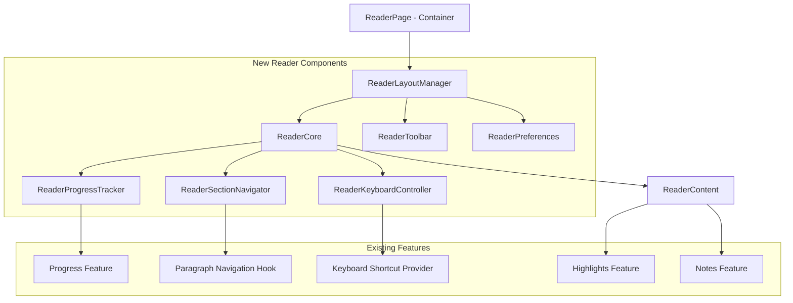

# Component Architecture

## Current Problem Analysis

The existing `src/features/reader/ReaderPage.tsx` component (1,127 lines) violates several architectural principles:

1. **God Component Anti-Pattern:** Handles reading, progress, navigation, highlighting, shortcuts, preferences, and more
2. **Complex State Management:** 15+ state variables mixed in single component
3. **Excessive Ref Management:** 8+ useRef hooks for different concerns
4. **Poor Separation of Concerns:** Business logic intertwined with UI rendering
5. **Testing Challenges:** Monolithic structure makes comprehensive testing difficult

## New Component Architecture

Based on BMAD principles and the existing feature-based architecture, we will decompose the reader into focused components:

### ReaderCore

**Responsibility:** Main reading experience coordination - handles scroll management, section visibility, and core reading interactions
**Integration Points:** Works with ReaderContent, ReaderToolbar, and progress tracking systems

**Key Interfaces:**
- Props: documentId, initialSectionId, user preferences
- State: Current section, scroll position, reading progress
- Events: Section changes, scroll events, user interactions

**Dependencies:**
- **Existing Components:** ReaderContent, ReaderToolbar
- **New Components:** ReaderProgressTracker, ReaderSectionNavigator
- **Technology Stack:** React, TypeScript, custom hooks

### ReaderProgressTracker

**Responsibility:** Isolated progress tracking logic - handles intersection observer, progress calculation, and persistence
**Integration Points:** Integrates with existing progress feature and React Query

**Key Interfaces:**
- Props: documentId, userId, sections
- State: Current progress, reading time, completion status
- Events: Progress updates, section completions

**Dependencies:**
- **Existing Components:** Progress feature components
- **New Components:** None (standalone service)
- **Technology Stack:** React hooks, Intersection Observer API

### ReaderSectionNavigator

**Responsibility:** Section switching and navigation logic - handles section transitions, navigation UI state
**Integration Points:** Works with existing paragraph navigation hook and document structure

**Key Interfaces:**
- Props: sections, currentSectionId, onSectionChange
- State: Navigation state, available sections
- Events: Section selection, navigation requests

**Dependencies:**
- **Existing Components:** Existing paragraph navigation utilities
- **New Components:** None
- **Technology Stack:** React, existing navigation hooks

### ReaderKeyboardController

**Responsibility:** Centralized keyboard shortcut handling - manages all keyboard interactions for reading experience
**Integration Points:** Integrates with existing keyboard shortcut providers and reading actions

**Key Interfaces:**
- Props: key bindings, action handlers
- State: Active shortcuts, keyboard state
- Events: Keyboard events, shortcut triggers

**Dependencies:**
- **Existing Components:** Existing keyboard shortcut providers
- **New Components:** None
- **Technology Stack:** React keyboard event handling

### ReaderLayoutManager

**Responsibility:** Layout coordination and responsive behavior - manages toolbar positioning, responsive layout states
**Integration Points:** Coordinates layout between ReaderCore, ReaderToolbar, and responsive design system

**Key Interfaces:**
- Props: viewport size, layout preferences
- State: Layout configuration, responsive state
- Events: Layout changes, viewport updates

**Dependencies:**
- **Existing Components:** ReaderToolbar, responsive utilities
- **New Components:** All other reader components
- **Technology Stack:** React, Tailwind CSS, responsive design

## Component Interaction Diagram

