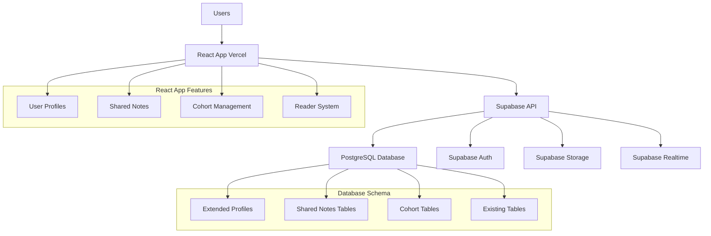
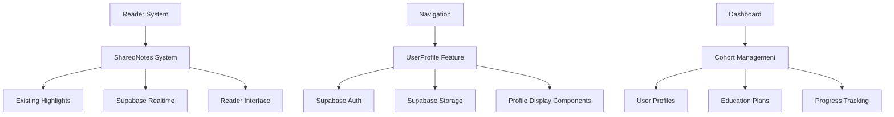
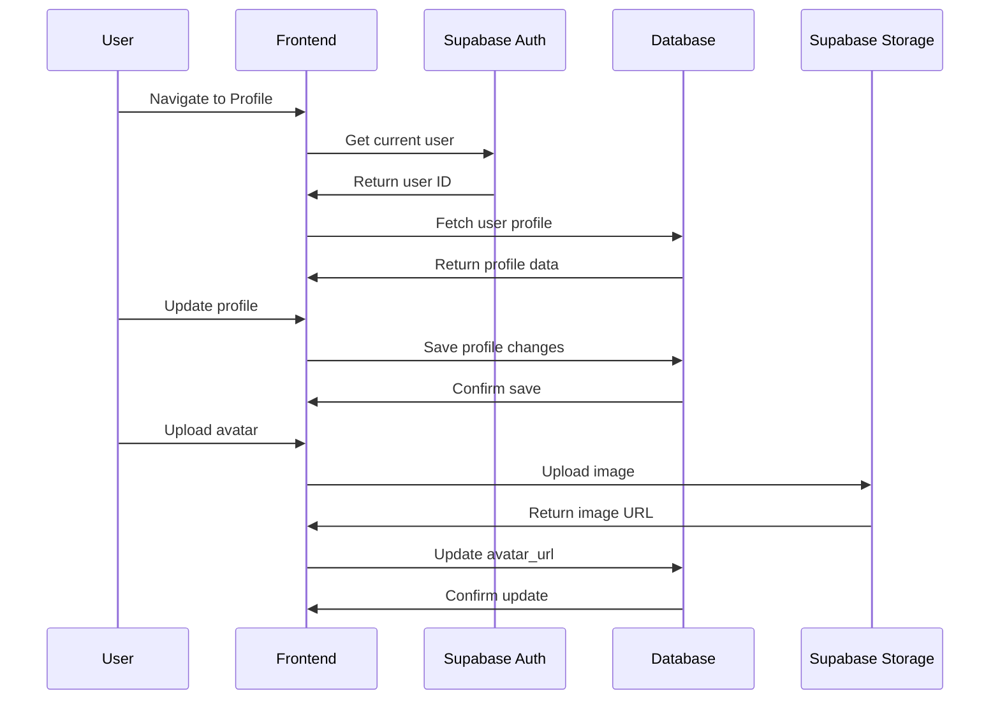
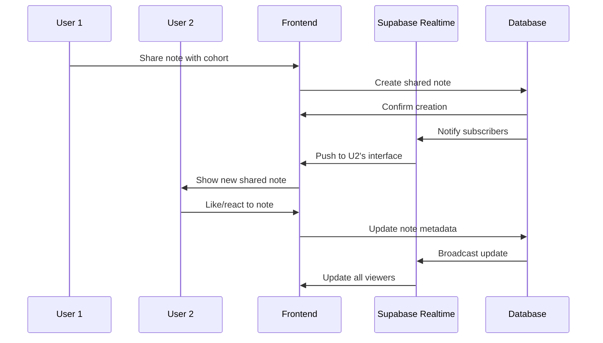
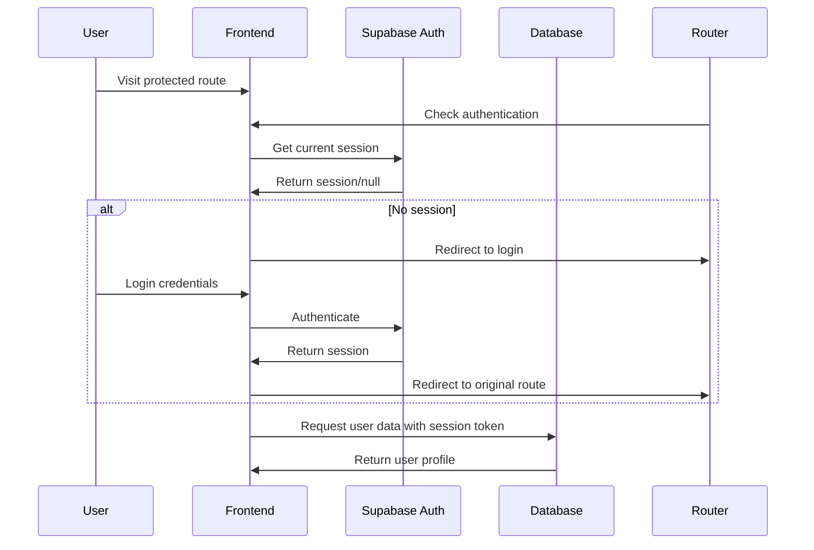
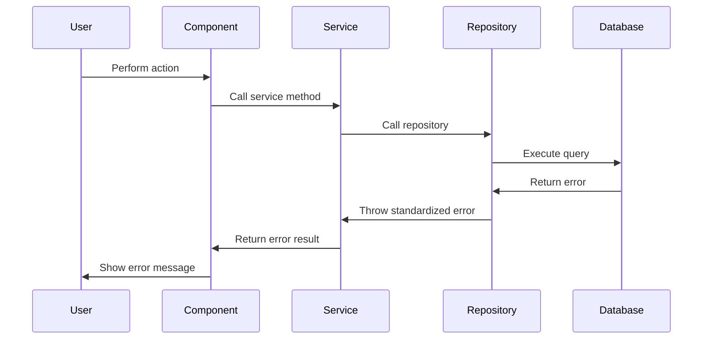

# Science of Revolution Fullstack Launch Features Architecture

## Introduction

This document outlines the complete fullstack architecture for Science of Revolution's launch features: User Profile System, Shared Notes functionality, and Cohort Management capabilities. This unified approach builds on the existing React + Supabase foundation to add collaborative reading features while maintaining the platform's technical excellence.

This unified approach combines what would traditionally be separate backend and frontend architecture documents, streamlining the development process for modern fullstack applications where these concerns are increasingly intertwined.

### Starter Template or Existing Project

**BASE EXISTING PROJECT:** Science of Revolution (React + TypeScript + Supabase)
- **Current Foundation:** Well-architected React 18.3.1 + TypeScript 5.5.4 + Supabase
- **Monolithic Issue:** ReaderPage.tsx (1,127 lines) - being addressed in separate brownfield enhancement
- **Enhancement Scope:** Adding user profiles, shared notes, and cohort management to existing foundation
- **Key Constraints:** Must maintain 100% backward compatibility and existing tech stack

### Change Log

| Date | Version | Description | Author |
|------|---------|-------------|---------|
| 2025-10-18 | 1.0 | Initial fullstack architecture for launch features | Winston (Architect) |

## High Level Architecture

### Technical Summary

Science of Revolution is a mobile-friendly, gamified social reading platform for Marxist study materials built on React 18.3.1, TypeScript 5.5.4, and Supabase. This architecture extends the existing platform with collaborative features including user profiles with avatar management, real-time shared notes, and cohort management for educational groups. The system uses Supabase for backend services (PostgreSQL + Auth + Storage + Realtime), React Query for server state management, and maintains the existing feature-based frontend architecture for seamless integration.

### Platform and Infrastructure Choice

**Platform:** Supabase + Vercel (existing)
**Key Services:** Supabase (PostgreSQL, Auth, Storage, Realtime), Vercel (frontend hosting)
**Deployment Host and Regions:** Vercel global edge network, Supabase US-East

**Rationale:** Sticking with proven existing stack ensures stability while adding new collaborative features. Supabase's real-time capabilities are perfect for shared notes, and existing auth integration simplifies profile management.

### Repository Structure

**Structure:** Monorepo (existing)
**Monorepo Tool:** npm workspaces (existing)
**Package Organization:** Feature-based modules under `src/features/`

### High Level Architecture Diagram



### Architectural Patterns

- **Feature-Based Architecture:** Organize code by business capabilities (profiles, shared-notes, cohorts)
- **Repository Pattern:** Abstract data access logic for maintainability and testing
- **React Query for Server State:** Efficient caching and synchronization with Supabase
- **Real-time Updates:** Supabase realtime subscriptions for collaborative features
- **Component-Based UI:** Reusable React components with TypeScript for type safety
- **Progressive Enhancement:** Add new features without breaking existing functionality

## Tech Stack

### Technology Stack Table

| Category | Technology | Version | Purpose | Rationale |
|----------|------------|---------|---------|-----------|
| Frontend Language | TypeScript | 5.5.4 | Type safety and better DX | Existing standard, maintain consistency |
| Frontend Framework | React | 18.3.1 | UI framework with hooks | Existing foundation, excellent ecosystem |
| UI Component Library | Tailwind CSS | 3.4.14 | Styling framework | Existing implementation, typography focus |
| State Management | React Query | 5.50.1 | Server state management | Existing implementation, perfect for Supabase |
| State Management | Zustand | 4.5.2 | UI state management | Existing implementation, lightweight |
| Backend Language | PostgreSQL | 15+ | Database language | Supabase foundation, reliable |
| Backend Framework | Supabase | Latest | Backend-as-a-Service | Existing implementation, auth + realtime |
| API Style | REST | Auto-generated | Supabase auto-generates from schema | Simplicity, automatic documentation |
| Database | PostgreSQL | 15+ | Primary database | Supabase foundation, robust |
| Cache | React Query | 5.50.1 | Client-side caching | Existing implementation, handles invalidation |
| File Storage | Supabase Storage | Latest | Avatar and file storage | Integrated with existing auth |
| Authentication | Supabase Auth | Latest | User authentication | Existing implementation, proven |
| Frontend Testing | Vitest | 2.1.4 | Unit testing | Existing implementation |
| Backend Testing | Supabase Tests | Latest | Database testing | Built-in to Supabase |
| E2E Testing | Playwright | 1.48.2 | End-to-end testing | Existing implementation |
| Build Tool | Vite | 5.4.9 | Build and dev server | Existing implementation, fast |
| CI/CD | GitHub Actions | Latest | Continuous integration | Standard for modern development |
| Monitoring | Supabase Dashboard | Latest | Backend monitoring | Built-in to platform |
| CSS Framework | Tailwind CSS | 3.4.14 | Utility-first styling | Existing implementation, consistent |

## Data Models

### UserProfile

**Purpose:** Extended user profile information beyond basic auth, including display preferences, avatar, and privacy settings for collaborative features.

**Key Attributes:**
- id: UUID - Primary key (references auth.users)
- display_name: string - User's chosen display name
- avatar_url: string - URL to profile image
- bio: text - User biography
- reading_preferences: JSON - User's reading settings
- privacy_settings: JSON - Privacy controls for sharing
- created_at: timestamp - Account creation time
- updated_at: timestamp - Last profile update

**TypeScript Interface:**
```typescript
interface UserProfile {
  id: string;
  display_name: string;
  avatar_url?: string;
  bio?: string;
  reading_preferences: {
    font_size: number;
    theme: 'light' | 'dark';
    reading_speed: 'slow' | 'normal' | 'fast';
  };
  privacy_settings: {
    profile_visibility: 'public' | 'cohorts' | 'private';
    share_reading_progress: boolean;
    allow_shared_notes: boolean;
  };
  created_at: string;
  updated_at: string;
}
```

**Relationships:**
- One-to-one with auth.users
- One-to-many with cohort_memberships
- One-to-many with shared_notes

### Cohort

**Purpose:** Educational reading groups that facilitators can create and manage for collaborative learning experiences.

**Key Attributes:**
- id: UUID - Primary key
- name: string - Cohort name
- description: text - Cohort description
- facilitator_id: UUID - References user_profiles.id
- education_plan_id: UUID - References education plans
- settings: JSON - Cohort-specific settings
- is_active: boolean - Cohort status
- created_at: timestamp - Creation time
- updated_at: timestamp - Last update

**TypeScript Interface:**
```typescript
interface Cohort {
  id: string;
  name: string;
  description: string;
  facilitator_id: string;
  education_plan_id: string;
  settings: {
    privacy: 'public' | 'private' | 'invite_only';
    allow_member_invites: boolean;
    moderate_shared_notes: boolean;
  };
  is_active: boolean;
  created_at: string;
  updated_at: string;
}
```

**Relationships:**
- Many-to-one with user_profiles (facilitator)
- One-to-many with cohort_memberships
- One-to-many with shared_notes

### SharedNote

**Purpose:** Annotations and highlights that users choose to share with their cohorts, enabling collaborative reading experiences.

**Key Attributes:**
- id: UUID - Primary key
- highlight_id: UUID - References existing highlights
- user_profile_id: UUID - References user_profiles
- cohort_id: UUID - References cohorts
- visibility_level: enum - Visibility scope
- content: text - Note content
- metadata: JSON - Additional data
- created_at: timestamp - Creation time
- updated_at: timestamp - Last update

**TypeScript Interface:**
```typescript
interface SharedNote {
  id: string;
  highlight_id: string;
  user_profile_id: string;
  cohort_id: string;
  visibility_level: 'cohort' | 'public' | 'private';
  content: string;
  metadata: {
    likes: number;
    replies: number;
    last_activity: string;
  };
  created_at: string;
  updated_at: string;
}
```

**Relationships:**
- Many-to-one with highlights
- Many-to-one with user_profiles
- Many-to-one with cohorts

## API Specification

### REST API Specification

```yaml
openapi: 3.0.0
info:
  title: Science of Revolution API
  version: 1.0.0
  description: API for collaborative reading platform
servers:
  - url: https://your-project.supabase.co/rest/v1
    description: Supabase REST API

paths:
  /user_profiles:
    get:
      summary: Get user profiles
      parameters:
        - name: id
          in: query
          schema:
            type: string
      responses:
        '200':
          description: Successful response
    post:
      summary: Create/update user profile
      requestBody:
        required: true
        content:
          application/json:
            schema:
              $ref: '#/components/schemas/UserProfile'

  /cohorts:
    get:
      summary: Get user's cohorts
    post:
      summary: Create new cohort
      requestBody:
        required: true
        content:
          application/json:
            schema:
              $ref: '#/components/schemas/Cohort'

  /cohorts/{id}/members:
    get:
      summary: Get cohort members
    post:
      summary: Add cohort member

  /shared_notes:
    get:
      summary: Get shared notes for document/cohort
      parameters:
        - name: document_id
          in: query
          schema:
            type: string
        - name: cohort_id
          in: query
          schema:
            type: string
    post:
      summary: Create shared note
      requestBody:
        required: true
        content:
          application/json:
            schema:
              $ref: '#/components/schemas/SharedNote'

components:
  schemas:
    UserProfile:
      type: object
      properties:
        id:
          type: string
        display_name:
          type: string
        avatar_url:
          type: string
        bio:
          type: string
        reading_preferences:
          type: object
        privacy_settings:
          type: object
```

## Components

### UserProfile Feature

**Responsibility:** Manage user profile configuration, avatar uploads, and privacy settings. Integrates with existing Supabase auth and provides profile data throughout the application.

**Key Interfaces:**
- Profile form components for editing user information
- Avatar upload component with Supabase Storage integration
- Privacy settings controls for feature visibility
- Profile display components used across the app

**Dependencies:** Supabase Auth, Supabase Storage, existing user management system

**Technology Stack:** React components, TypeScript interfaces, React Query for server state, Supabase client SDK

### SharedNotes System

**Responsibility:** Enable users to see and interact with notes shared by their cohorts. Real-time updates using Supabase realtime subscriptions, filtering by visibility and cohort membership.

**Key Interfaces:**
- Shared notes panel component in reader interface
- Note interaction components (like, reply, report)
- Real-time subscription handlers for live updates
- Filtering and search functionality for shared content

**Dependencies:** Existing highlights system, cohort management, Supabase realtime, reader interface

**Technology Stack:** React components with real-time subscriptions, React Query for caching, Supabase realtime client

### Cohort Management

**Responsibility:** Complete cohort system for facilitators to create and manage reading groups, and for members to participate in collaborative learning activities.

**Key Interfaces:**
- Cohort creation and management interface for facilitators
- Member dashboard showing cohort progress and activities
- Progress tracking and analytics for facilitators
- Cohort switching interface for multi-cohort users

**Dependencies:** User profiles, education plans, progress tracking system, shared notes

**Technology Stack:** React management interfaces, TypeScript, React Query for data synchronization, Supabase RLS policies

### Component Diagrams



## External APIs

**No external APIs required** - all functionality is built on Supabase's integrated platform (Auth, Storage, Database, Realtime).

## Core Workflows

### User Profile Configuration Workflow



### Shared Notes Real-time Workflow



## Database Schema

```sql
-- Extended user profiles table
CREATE TABLE user_profiles (
  id UUID REFERENCES auth.users(id) PRIMARY KEY,
  display_name TEXT NOT NULL,
  avatar_url TEXT,
  bio TEXT,
  reading_preferences JSONB DEFAULT '{}',
  privacy_settings JSONB DEFAULT '{}',
  created_at TIMESTAMP WITH TIME ZONE DEFAULT NOW(),
  updated_at TIMESTAMP WITH TIME ZONE DEFAULT NOW()
);

-- Cohorts table
CREATE TABLE cohorts (
  id UUID DEFAULT gen_random_uuid() PRIMARY KEY,
  name TEXT NOT NULL,
  description TEXT,
  facilitator_id UUID REFERENCES user_profiles(id),
  education_plan_id UUID REFERENCES education_plans(id),
  settings JSONB DEFAULT '{}',
  is_active BOOLEAN DEFAULT true,
  created_at TIMESTAMP WITH TIME ZONE DEFAULT NOW(),
  updated_at TIMESTAMP WITH TIME ZONE DEFAULT NOW()
);

-- Cohort memberships table
CREATE TABLE cohort_memberships (
  id UUID DEFAULT gen_random_uuid() PRIMARY KEY,
  user_profile_id UUID REFERENCES user_profiles(id),
  cohort_id UUID REFERENCES cohorts(id),
  role TEXT CHECK (role IN ('facilitator', 'member')) DEFAULT 'member',
  joined_at TIMESTAMP WITH TIME ZONE DEFAULT NOW(),
  status TEXT CHECK (status IN ('active', 'inactive', 'pending')) DEFAULT 'active',
  UNIQUE(user_profile_id, cohort_id)
);

-- Shared notes table (extends existing highlights)
CREATE TABLE shared_notes (
  id UUID DEFAULT gen_random_uuid() PRIMARY KEY,
  highlight_id UUID REFERENCES highlights(id) ON DELETE CASCADE,
  user_profile_id UUID REFERENCES user_profiles(id),
  cohort_id UUID REFERENCES cohorts(id),
  visibility_level TEXT CHECK (visibility_level IN ('cohort', 'public', 'private')) DEFAULT 'cohort',
  content TEXT NOT NULL,
  metadata JSONB DEFAULT '{}',
  created_at TIMESTAMP WITH TIME ZONE DEFAULT NOW(),
  updated_at TIMESTAMP WITH TIME ZONE DEFAULT NOW()
);

-- Shared note interactions table
CREATE TABLE shared_note_interactions (
  id UUID DEFAULT gen_random_uuid() PRIMARY KEY,
  shared_note_id UUID REFERENCES shared_notes(id) ON DELETE CASCADE,
  user_profile_id UUID REFERENCES user_profiles(id),
  interaction_type TEXT CHECK (interaction_type IN ('like', 'reply', 'report')) NOT NULL,
  content TEXT, -- for replies
  created_at TIMESTAMP WITH TIME ZONE DEFAULT NOW(),
  UNIQUE(shared_note_id, user_profile_id, interaction_type)
);

-- Indexes for performance
CREATE INDEX idx_cohorts_facilitator ON cohorts(facilitator_id);
CREATE INDEX idx_cohort_memberships_user ON cohort_memberships(user_profile_id);
CREATE INDEX idx_cohort_memberships_cohort ON cohort_memberships(cohort_id);
CREATE INDEX idx_shared_notes_highlight ON shared_notes(highlight_id);
CREATE INDEX idx_shared_notes_user ON shared_notes(user_profile_id);
CREATE INDEX idx_shared_notes_cohort ON shared_notes(cohort_id);
CREATE INDEX idx_shared_notes_visibility ON shared_notes(visibility_level);
```

## Frontend Architecture

### Component Architecture

**Component Organization:**
```
src/features/
├── user-profiles/
│   ├── components/
│   │   ├── ProfileConfiguration.tsx
│   │   ├── AvatarUpload.tsx
│   │   ├── PrivacySettings.tsx
│   │   └── ProfileDisplay.tsx
│   ├── hooks/
│   │   ├── useUserProfile.ts
│   │   └── useAvatarUpload.ts
│   └── services/
│       └── profileService.ts
├── shared-notes/
│   ├── components/
│   │   ├── SharedNotesPanel.tsx
│   │   ├── SharedNoteCard.tsx
│   │   └── NoteInteractions.tsx
│   ├── hooks/
│   │   ├── useSharedNotes.ts
│   │   └── useRealtimeNotes.ts
│   └── services/
│       └── sharedNotesService.ts
└── cohorts/
    ├── components/
    │   ├── CohortManagement.tsx
    │   ├── CohortDashboard.tsx
    │   ├── MemberList.tsx
    │   └── ProgressAnalytics.tsx
    ├── hooks/
    │   ├── useCohorts.ts
    │   └── useCohortManagement.ts
    └── services/
        └── cohortService.ts
```

**Component Template:**
```typescript
interface ProfileConfigurationProps {
  userId: string;
  onSave?: (profile: UserProfile) => void;
}

export const ProfileConfiguration: React.FC<ProfileConfigurationProps> = ({
  userId,
  onSave
}) => {
  const { data: profile, isLoading, updateProfile } = useUserProfile(userId);

  const handleSubmit = async (formData: UserProfileFormData) => {
    await updateProfile(formData);
    onSave?.(profile!);
  };

  if (isLoading) return <ProfileSkeleton />;

  return (
    <ProfileForm
      initialData={profile}
      onSubmit={handleSubmit}
    />
  );
};
```

### State Management Architecture

**State Structure:**
```typescript
interface SharedNotesState {
  notes: SharedNote[];
  filters: {
    cohortId?: string;
    visibility?: VisibilityLevel;
    userId?: string;
  };
  realTimeConnected: boolean;
  unreadCount: number;
}

interface CohortsState {
  myCohorts: Cohort[];
  activeCohort: Cohort | null;
  members: UserProfile[];
  analytics: CohortAnalytics;
}
```

**State Management Patterns:**
- React Query for server state synchronization with Supabase
- Zustand for UI state that doesn't need persistence
- Local component state for form inputs and temporary UI states
- Real-time subscriptions using Supabase realtime client

### Routing Architecture

**Route Organization:**
```
/profile                    # User profile configuration
/cohorts                    # My cohorts dashboard
/cohorts/[id]              # Specific cohort view
/cohorts/[id]/manage       # Cohort management (facilitators)
/cohorts/[id]/progress     # Progress tracking
/read/[documentId]         # Enhanced reader with shared notes
```

**Protected Route Pattern:**
```typescript
const ProtectedRoute: React.FC<{ children: React.ReactNode }> = ({ children }) => {
  const { user, isLoading } = useAuth();

  if (isLoading) return <LoadingSpinner />;
  if (!user) return <Navigate to="/auth" replace />;

  return <>{children}</>;
};
```

### Frontend Services Layer

**API Client Setup:**
```typescript
import { createClient } from '@supabase/supabase-js';

const supabase = createClient(
  import.meta.env.VITE_SUPABASE_URL,
  import.meta.env.VITE_SUPABASE_ANON_KEY
);

export const apiClient = {
  profiles: {
    get: (userId: string) => supabase
      .from('user_profiles')
      .select('*')
      .eq('id', userId)
      .single(),

    update: (userId: string, data: Partial<UserProfile>) => supabase
      .from('user_profiles')
      .update(data)
      .eq('id', userId)
  },

  sharedNotes: {
    getByDocument: (documentId: string, cohortId?: string) => supabase
      .from('shared_notes')
      .select('*, user_profiles(*)')
      .eq('document_id', documentId)
      .eq('visibility_level', 'cohort')
      .eq('cohort_id', cohortId)
  }
};
```

**Service Example:**
```typescript
export class ProfileService {
  async getProfile(userId: string): Promise<UserProfile> {
    const { data, error } = await apiClient.profiles.get(userId);
    if (error) throw new Error(error.message);
    return data;
  }

  async updateProfile(userId: string, updates: Partial<UserProfile>): Promise<UserProfile> {
    const { data, error } = await apiClient.profiles.update(userId, updates);
    if (error) throw new Error(error.message);
    return data;
  }

  async uploadAvatar(file: File): Promise<string> {
    const fileExt = file.name.split('.').pop();
    const fileName = `${Date.now()}.${fileExt}`;

    const { error } = await supabase.storage
      .from('avatars')
      .upload(fileName, file);

    if (error) throw new Error(error.message);

    const { data: { publicUrl } } = supabase.storage
      .from('avatars')
      .getPublicUrl(fileName);

    return publicUrl;
  }
}
```

## Backend Architecture

### Service Architecture

**Serverless Architecture (Supabase):**

**Function Organization:**
```
Supabase Edge Functions (if needed):
├── shared-notifications/    # Email notifications for shared notes
├── cohort-analytics/        # Analytics calculations
└── content-moderation/      # Automated moderation
```

**Function Template:**
```typescript
import { serve } from 'https://deno.land/std@0.168.0/http/server.ts'
import { createClient } from 'https://esm.sh/@supabase/supabase-js@2'

serve(async (req) => {
  const supabase = createClient(
    Deno.env.get('SUPABASE_URL')!,
    Deno.env.get('SUPABASE_SERVICE_ROLE_KEY')!
  );

  const { method } = req;

  if (method === 'POST') {
    const { cohortId, message } = await req.json();

    // Handle cohort notification logic
    await sendCohortNotification(cohortId, message);

    return new Response(
      JSON.stringify({ success: true }),
      { headers: { "Content-Type": "application/json" } }
    );
  }
});
```

### Database Architecture

**Schema Design:**
```sql
-- Row Level Security Policies
ALTER TABLE user_profiles ENABLE ROW LEVEL SECURITY;
ALTER TABLE cohorts ENABLE ROW LEVEL SECURITY;
ALTER TABLE shared_notes ENABLE ROW LEVEL SECURITY;

-- User can only edit their own profile
CREATE POLICY "Users can edit own profile" ON user_profiles
  FOR ALL USING (auth.uid() = id);

-- Cohort members can view their cohorts
CREATE POLICY "Cohort members can view cohort" ON cohorts
  FOR SELECT USING (
    id IN (
      SELECT cohort_id FROM cohort_memberships
      WHERE user_profile_id = auth.uid()
    )
  );

-- Shared notes visibility based on cohort membership
CREATE POLICY "Shared notes visibility" ON shared_notes
  FOR SELECT USING (
    visibility_level = 'public' OR
    (visibility_level = 'cohort' AND
     cohort_id IN (
       SELECT cohort_id FROM cohort_memberships
       WHERE user_profile_id = auth.uid()
     )
    )
  );
```

**Data Access Layer:**
```typescript
export class CohortRepository {
  async getUserCohorts(userId: string): Promise<Cohort[]> {
    const { data, error } = await supabase
      .from('cohorts')
      .select(`
        *,
        cohort_memberships!inner(
          user_profile_id,
          role
        )
      `)
      .eq('cohort_memberships.user_profile_id', userId)
      .eq('is_active', true);

    if (error) throw new Error(error.message);
    return data;
  }

  async createCohort(cohort: CreateCohortDto): Promise<Cohort> {
    const { data, error } = await supabase
      .from('cohorts')
      .insert(cohort)
      .select()
      .single();

    if (error) throw new Error(error.message);

    // Automatically add creator as facilitator
    await this.addMember(data.id, cohort.facilitator_id, 'facilitator');

    return data;
  }
}
```

### Authentication and Authorization

**Auth Flow:**


**Middleware/Guards:**
```typescript
// Supabase RLS handles most authorization
// Additional client-side guards for UI protection

export const useCohortGuard = (cohortId: string) => {
  const { data: membership } = useQuery({
    queryKey: ['cohort-membership', cohortId],
    queryFn: () => getCohortMembership(cohortId)
  });

  return {
    isMember: !!membership,
    isFacilitator: membership?.role === 'facilitator',
    canManage: membership?.role === 'facilitator'
  };
};
```

## Unified Project Structure

```text
science-of-revolution/
├── .github/                    # CI/CD workflows
│   └── workflows/
│       ├── ci.yaml
│       └── deploy.yaml
├── src/
│   ├── components/             # Shared UI components
│   │   └── ui/                # Reusable UI primitives
│   ├── features/              # Feature-based modules
│   │   ├── user-profiles/     # NEW: Profile management
│   │   │   ├── components/
│   │   │   ├── hooks/
│   │   │   └── services/
│   │   ├── shared-notes/      # NEW: Collaborative notes
│   │   │   ├── components/
│   │   │   ├── hooks/
│   │   │   └── services/
│   │   ├── cohorts/           # NEW: Cohort management
│   │   │   ├── components/
│   │   │   ├── hooks/
│   │   │   └── services/
│   │   ├── reader/            # EXISTING: Reading system
│   │   ├── highlights/        # EXISTING: Annotations
│   │   ├── progress/          # EXISTING: Progress tracking
│   │   └── education-plans/   # EXISTING: Learning paths
│   ├── hooks/                 # Global hooks
│   ├── lib/                   # Utilities and configuration
│   │   ├── supabase/          # Supabase client setup
│   │   ├── repositories/      # Data access layer
│   │   └── database.types.ts  # Generated types
│   └── styles/                # Global styles
├── supabase/                  # Supabase configuration
│   ├── migrations/            # Database migrations
│   ├── functions/             # Edge functions
│   └── seed.sql              # Seed data
├── tests/                     # Test files
│   ├── features/              # Feature-specific tests
│   └── e2e/                   # End-to-end tests
├── docs/                      # Documentation
│   ├── prd.md
│   ├── architecture/
│   │   └── fullstack-launch-features.md
│   └── brownfield-*.md
├── package.json
├── vite.config.ts
├── tailwind.config.js
└── README.md
```

## Development Workflow

### Local Development Setup

**Prerequisites:**
```bash
# Required tools
node --version  # 20+
npm --version   # 9+
git --version
```

**Initial Setup:**
```bash
# Clone repository
git clone <repository-url>
cd science-of-revolution

# Install dependencies
npm install

# Copy environment template
cp .env.example .env.local

# Configure Supabase
supabase link <project-ref>
supabase db push  # Apply new migrations

# Start development
npm run dev
```

**Development Commands:**
```bash
# Start all services
npm run dev                # Frontend + Supabase local

# Start frontend only
npm run dev:frontend       # Just Vite dev server

# Run tests
npm run test               # Unit tests
npm run test:e2e          # End-to-end tests
npm run test:coverage     # Coverage report

# Database operations
supabase db reset         # Reset local database
supabase db diff          # Show schema changes
supabase gen types typescript # Update types
```

### Environment Configuration

**Required Environment Variables:**
```bash
# Frontend (.env.local)
VITE_SUPABASE_URL=your-project.supabase.co
VITE_SUPABASE_ANON_KEY=your-anon-key

# Backend (Supabase)
SUPABASE_SERVICE_ROLE_KEY=your-service-role-key
```

## Deployment Architecture

### Deployment Strategy

**Frontend Deployment:**
- **Platform:** Vercel (existing)
- **Build Command:** `npm run build`
- **Output Directory:** `dist`
- **CDN/Edge:** Vercel Edge Network

**Backend Deployment:**
- **Platform:** Supabase (existing)
- **Build Command:** N/A (managed service)
- **Deployment Method:** Supabase CLI migrations

### CI/CD Pipeline
```yaml
name: CI/CD Pipeline
on:
  push:
    branches: [main, develop]
  pull_request:
    branches: [main]

jobs:
  test:
    runs-on: ubuntu-latest
    steps:
      - uses: actions/checkout@v3
      - uses: actions/setup-node@v3
        with:
          node-version: '20'
      - run: npm ci
      - run: npm run lint
      - run: npm run typecheck
      - run: npm run test
      - run: npm run test:e2e

  deploy:
    needs: test
    runs-on: ubuntu-latest
    if: github.ref == 'refs/heads/main'
    steps:
      - uses: actions/checkout@v3
      - name: Deploy to Vercel
        uses: amondnet/vercel-action@v20
      - name: Deploy Supabase migrations
        run: supabase db push
```

### Environments

| Environment | Frontend URL | Backend URL | Purpose |
|-------------|--------------|-------------|---------|
| Development | localhost:5173 | localhost:54321 | Local development |
| Staging | pr-preview.vercel.app | staging.supabase.co | Pre-production testing |
| Production | science-of-revolution.vercel.app | production.supabase.co | Live environment |

## Security and Performance

### Security Requirements

**Frontend Security:**
- CSP Headers: Default Supabase policies
- XSS Prevention: React's built-in protection
- Secure Storage: Supabase session storage

**Backend Security:**
- Input Validation: Supabase validation + Zod schemas
- Rate Limiting: Supabase built-in rate limiting
- CORS Policy: Configured for Vercel domain

**Authentication Security:**
- Token Storage: Supabase handles JWT storage
- Session Management: Supabase refresh token rotation
- Password Policy: Supabase auth policies

### Performance Optimization

**Frontend Performance:**
- Bundle Size Target: <1MB initial load
- Loading Strategy: Lazy loading for routes
- Caching Strategy: React Query with stale-while-revalidate

**Backend Performance:**
- Response Time Target: <200ms for API calls
- Database Optimization: Indexed queries, connection pooling
- Caching Strategy: Supabase edge caching

## Testing Strategy

### Testing Pyramid

```
E2E Tests (Playwright)
/        \
Integration Tests (Vitest + Testing Library)
/            \
Frontend Unit    Backend Unit (Vitest)
```

### Test Organization

**Frontend Tests:**
```
tests/features/
├── user-profiles/
│   ├── ProfileConfiguration.test.tsx
│   ├── AvatarUpload.test.tsx
│   └── ProfileService.test.ts
├── shared-notes/
│   ├── SharedNotesPanel.test.tsx
│   ├── RealtimeNotes.test.tsx
│   └── SharedNotesService.test.ts
└── cohorts/
    ├── CohortManagement.test.tsx
    ├── MemberList.test.tsx
    └── CohortService.test.ts
```

**Backend Tests:**
```
tests/backend/
├── repository/
│   ├── UserProfileRepository.test.ts
│   ├── CohortRepository.test.ts
│   └── SharedNotesRepository.test.ts
└── migrations/
    └── schema.test.ts
```

**E2E Tests:**
```
tests/e2e/
├── user-profile.spec.ts
├── shared-notes.spec.ts
├── cohort-management.spec.ts
└── collaborative-reading.spec.ts
```

### Test Examples

**Frontend Component Test:**
```typescript
import { render, screen, fireEvent, waitFor } from '@testing-library/react';
import { QueryClient, QueryClientProvider } from '@tanstack/react-query';
import { ProfileConfiguration } from '../ProfileConfiguration';

const createTestQueryClient = () => new QueryClient({
  defaultOptions: { queries: { retry: false } }
});

describe('ProfileConfiguration', () => {
  it('should save profile changes', async () => {
    const queryClient = createTestQueryClient();
    const mockSave = jest.fn();

    render(
      <QueryClientProvider client={queryClient}>
        <ProfileConfiguration userId="test-user" onSave={mockSave} />
      </QueryClientProvider>
    );

    const displayNameInput = screen.getByLabelText('Display Name');
    fireEvent.change(displayNameInput, { target: { value: 'New Name' } });

    fireEvent.click(screen.getByText('Save'));

    await waitFor(() => {
      expect(mockSave).toHaveBeenCalledWith(
        expect.objectContaining({ display_name: 'New Name' })
      );
    });
  });
});
```

**Backend API Test:**
```typescript
import { createClient } from '@supabase/supabase-js';
import { ProfileService } from '../ProfileService';

describe('ProfileService', () => {
  let profileService: ProfileService;
  let supabase: any;

  beforeEach(() => {
    supabase = createClient(process.env.TEST_SUPABASE_URL, process.env.TEST_SUPABASE_KEY);
    profileService = new ProfileService(supabase);
  });

  it('should update user profile', async () => {
    const userId = 'test-user-id';
    const updates = { display_name: 'Updated Name' };

    const result = await profileService.updateProfile(userId, updates);

    expect(result.display_name).toBe('Updated Name');
  });
});
```

**E2E Test:**
```typescript
import { test, expect } from '@playwright/test';

test('user can configure profile and join cohort', async ({ page }) => {
  // Login
  await page.goto('/login');
  await page.fill('[data-testid=email]', 'test@example.com');
  await page.fill('[data-testid=password]', 'password');
  await page.click('[data-testid=login-button]');

  // Configure profile
  await page.goto('/profile');
  await page.fill('[data-testid=display-name]', 'Test User');
  await page.setInputFiles('[data-testid=avatar-upload]', 'test-assets/avatar.jpg');
  await page.click('[data-testid=save-profile]');

  // Join cohort
  await page.goto('/cohorts');
  await page.click('[data-testid=join-cohort-button]');
  await expect(page.locator('[data-testid=success-message]')).toBeVisible();
});
```

## Coding Standards

### Critical Fullstack Rules

- **Type Sharing:** Always define types in `src/lib/database.types.ts` and import from there
- **API Calls:** Never make direct HTTP calls - use the repository layer
- **Environment Variables:** Access only through `.env.local` - never `process.env` directly in components
- **Error Handling:** All repository methods must throw consistent error types
- **State Updates:** Never mutate state directly - use proper React Query mutation patterns
- **RLS Policies:** All new tables must have Row Level Security policies defined
- **Real-time Subscriptions:** Always clean up subscriptions in useEffect cleanup functions

### Naming Conventions

| Element | Frontend | Backend | Example |
|---------|----------|---------|---------|
| Components | PascalCase | - | `UserProfile.tsx` |
| Hooks | camelCase with 'use' | - | `useUserProfile.ts` |
| API Routes | - | kebab-case | `/user-profiles` |
| Database Tables | - | snake_case | `user_profiles` |
| Functions | camelCase | snake_case | `getUserProfile` |
| Constants | UPPER_SNAKE_CASE | UPPER_SNAKE_CASE | `MAX_FILE_SIZE` |

## Error Handling Strategy

### Error Flow



### Error Response Format

```typescript
interface ApiError {
  error: {
    code: string;
    message: string;
    details?: Record<string, any>;
    timestamp: string;
    requestId: string;
  };
}
```

### Frontend Error Handling

```typescript
export const useProfileUpdate = () => {
  return useMutation({
    mutationFn: profileService.updateProfile,
    onError: (error) => {
      if (error.code === 'PGRST116') {
        toast.error('Profile not found');
      } else if (error.code === '42501') {
        toast.error('Permission denied');
      } else {
        toast.error('Failed to update profile');
      }
    },
    onSuccess: () => {
      toast.success('Profile updated successfully');
    }
  });
};
```

### Backend Error Handling

```typescript
export class ProfileService {
  async updateProfile(userId: string, updates: Partial<UserProfile>): Promise<UserProfile> {
    try {
      const { data, error } = await supabase
        .from('user_profiles')
        .update(updates)
        .eq('id', userId)
        .select()
        .single();

      if (error) {
        throw new Error(error.message, { cause: error });
      }

      return data;
    } catch (error) {
      // Log error for debugging
      console.error('Profile update failed:', error);
      throw error;
    }
  }
}
```

## Monitoring and Observability

### Monitoring Stack

- **Frontend Monitoring:** Vercel Analytics (built-in)
- **Backend Monitoring:** Supabase Dashboard (built-in)
- **Error Tracking:** Supabase error logs
- **Performance Monitoring:** Vercel Speed Insights

### Key Metrics

**Frontend Metrics:**
- Core Web Vitals (LCP, FID, CLS)
- JavaScript errors (tracked in Vercel)
- API response times
- User interactions (profile updates, note sharing)

**Backend Metrics:**
- Request rate (Supabase dashboard)
- Error rate (Supabase logs)
- Response time (Supabase analytics)
- Database query performance

## Checklist Results Report

This comprehensive fullstack architecture document provides the complete technical blueprint for implementing User Profiles, Shared Notes, and Cohort Management features while maintaining the existing Science of Revolution platform's technical excellence.

**Key Architectural Decisions:**
1. **Build on Existing Foundation:** Leverage current React + Supabase stack
2. **Feature-Based Organization:** Maintain existing architectural patterns
3. **Real-time Collaboration:** Use Supabase realtime for shared notes
4. **Security First:** Implement proper RLS policies and access controls
5. **Performance Awareness:** Optimize for mobile reading experience
6. **Comprehensive Testing:** Unit, integration, and E2E test coverage
7. **Progressive Enhancement:** Add features without breaking existing functionality

This architecture ensures the new collaborative features integrate seamlessly with the existing reading experience while providing a solid foundation for future enhancements.

---

*Document generated using BMAD™ methodology and fullstack architecture template*