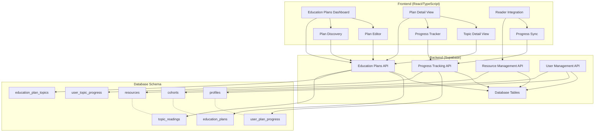
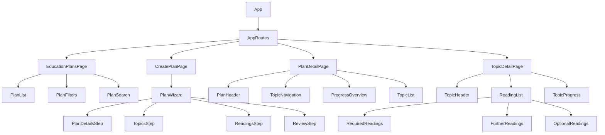

# Education Plan System - Implementation Roadmap

## System Architecture Overview



## Component Hierarchy



## Phase 1: Foundation (MVP - 6 weeks)

### Week 1-2: Database & Core Infrastructure
**Priority: Critical**

**Backend Tasks:**
- [ ] Create database migration for new tables
- [ ] Implement Row Level Security (RLS) policies
- [ ] Create Supabase functions for plan operations
- [ ] Set up TypeScript types for new schemas

**Frontend Tasks:**
- [ ] Create education plan folder structure
- [ ] Implement authentication checks for facilitator roles
- [ ] Create basic routing structure
- [ ] Set up error boundaries and loading states

**Deliverables:**
- Database schema deployed
- Basic folder structure
- Authentication integration
- Type definitions

### Week 3-4: Plan CRUD Operations
**Priority: High**

**Backend Tasks:**
- [ ] Implement education plan CRUD API
- [ ] Create topic management endpoints
- [ ] Build reading assignment system
- [ ] Add data validation and constraints

**Frontend Tasks:**
- [ ] Build PlanList component with filtering
- [ ] Create PlanDetailsForm component
- [ ] Implement TopicEditor component
- [ ] Build ReadingAssignment component

**Deliverables:**
- Full plan creation/editing functionality
- Topic management system
- Reading assignment interface
- Basic validation and error handling

### Week 5-6: Plan Discovery & Enrollment
**Priority: High**

**Backend Tasks:**
- [ ] Implement plan discovery API
- [ ] Create enrollment endpoints
- [ ] Build progress tracking foundation
- [ ] Add cohort-based filtering

**Frontend Tasks:**
- [ ] Create PlanDiscoveryPage component
- [ ] Build PlanCard component with enrollment
- [ ] Implement search and filtering
- [ ] Create EnrollmentButton component

**Deliverables:**
- Learner plan discovery interface
- Enrollment system
- Search and filtering functionality
- Cohort-based access control

## Phase 2: Learning Experience (4 weeks)

### Week 7-8: Progress Tracking System
**Priority: High**

**Backend Tasks:**
- [ ] Implement progress calculation logic
- [ ] Create progress update endpoints
- [ ] Build progress aggregation queries
- [ ] Add progress history tracking

**Frontend Tasks:**
- [ ] Create ProgressTracker component
- [ ] Build ProgressBar and ProgressRing components
- [ ] Implement TopicProgress component
- [ ] Create PlanProgressDashboard component

**Deliverables:**
- Comprehensive progress tracking
- Visual progress indicators
- Progress calculation engine
- History tracking system

### Week 9-10: Reader Integration
**Priority: High**

**Backend Tasks:**
- [ ] Integrate with existing progress system
- [ ] Create reading-to-plan mapping
- [ ] Build automatic progress updates
- [ ] Add reading completion detection

**Frontend Tasks:**
- [ ] Modify Reader for plan context
- [ ] Create ReadingNavigation component
- [ ] Implement automatic progress sync
- [ ] Build ReadingContext component

**Deliverables:**
- Seamless reader integration
- Automatic progress updates
- Reading context awareness
- Navigation between readings

## Phase 3: Advanced Features (4 weeks)

### Week 11-12: Template System & Analytics
**Priority: Medium**

**Backend Tasks:**
- [ ] Implement plan template system
- [ ] Create template cloning logic
- [ ] Build analytics aggregation
- [ ] Add engagement metrics

**Frontend Tasks:**
- [ ] Create TemplateLibrary component
- [ ] Build PlanAnalytics dashboard
- [ ] Implement TemplateWizard component
- [ ] Create AnalyticsCharts components

**Deliverables:**
- Plan template system
- Analytics dashboard
- Template cloning functionality
- Engagement metrics

### Week 13-14: Polish & Optimization
**Priority: Medium**

**Tasks:**
- [ ] Performance optimization
- [ ] Mobile responsiveness improvements
- [ ] Accessibility audit and fixes
- [ ] Loading state improvements
- [ ] Error handling enhancement
- [ ] Documentation completion

**Deliverables:**
- Performance optimizations
- Mobile-first responsive design
- WCAG AA compliance
- Comprehensive error handling
- Complete documentation

## Technical Specifications

### Database Migration Script

```sql
-- Education Plans
CREATE TABLE education_plans (
  id UUID PRIMARY KEY DEFAULT gen_random_uuid(),
  title TEXT NOT NULL,
  description TEXT,
  cohort_id UUID REFERENCES cohorts(id) ON DELETE CASCADE,
  created_by UUID REFERENCES profiles(id) ON DELETE RESTRICT,
  is_template BOOLEAN DEFAULT FALSE,
  is_published BOOLEAN DEFAULT FALSE,
  estimated_weeks INTEGER DEFAULT 4,
  difficulty_level TEXT CHECK (difficulty_level IN ('beginner', 'intermediate', 'advanced')),
  tags TEXT[] DEFAULT '{}',
  created_at TIMESTAMP WITH TIME ZONE DEFAULT NOW(),
  updated_at TIMESTAMP WITH TIME ZONE DEFAULT NOW()
);

-- Plan Topics
CREATE TABLE education_plan_topics (
  id UUID PRIMARY KEY DEFAULT gen_random_uuid(),
  education_plan_id UUID REFERENCES education_plans(id) ON DELETE CASCADE,
  title TEXT NOT NULL,
  description TEXT,
  order_index INTEGER NOT NULL,
  estimated_hours INTEGER DEFAULT 4,
  is_required BOOLEAN DEFAULT TRUE,
  created_at TIMESTAMP WITH TIME ZONE DEFAULT NOW(),
  updated_at TIMESTAMP WITH TIME ZONE DEFAULT NOW(),
  UNIQUE(education_plan_id, order_index)
);

-- Topic Readings
CREATE TABLE topic_readings (
  id UUID PRIMARY KEY DEFAULT gen_random_uuid(),
  topic_id UUID REFERENCES education_plan_topics(id) ON DELETE CASCADE,
  resource_id UUID REFERENCES resources(id) ON DELETE CASCADE,
  reading_type TEXT CHECK (reading_type IN ('required', 'further', 'optional')) DEFAULT 'required',
  order_index INTEGER NOT NULL,
  notes TEXT,
  created_at TIMESTAMP WITH TIME ZONE DEFAULT NOW(),
  UNIQUE(topic_id, resource_id)
);

-- User Plan Progress
CREATE TABLE user_plan_progress (
  id UUID PRIMARY KEY DEFAULT gen_random_uuid(),
  user_id UUID REFERENCES profiles(id) ON DELETE CASCADE,
  education_plan_id UUID REFERENCES education_plans(id) ON DELETE CASCADE,
  status TEXT CHECK (status IN ('not_started', 'in_progress', 'completed')) DEFAULT 'not_started',
  started_at TIMESTAMP WITH TIME ZONE,
  completed_at TIMESTAMP WITH TIME ZONE,
  current_topic_id UUID REFERENCES education_plan_topics(id),
  progress_percentage INTEGER DEFAULT 0 CHECK (progress_percentage >= 0 AND progress_percentage <= 100),
  created_at TIMESTAMP WITH TIME ZONE DEFAULT NOW(),
  updated_at TIMESTAMP WITH TIME ZONE DEFAULT NOW(),
  UNIQUE(user_id, education_plan_id)
);

-- User Topic Progress
CREATE TABLE user_topic_progress (
  id UUID PRIMARY KEY DEFAULT gen_random_uuid(),
  user_id UUID REFERENCES profiles(id) ON DELETE CASCADE,
  topic_id UUID REFERENCES education_plan_topics(id) ON DELETE CASCADE,
  status TEXT CHECK (status IN ('not_started', 'in_progress', 'completed')) DEFAULT 'not_started',
  started_at TIMESTAMP WITH TIME ZONE,
  completed_at TIMESTAMP WITH TIME ZONE,
  progress_percentage INTEGER DEFAULT 0 CHECK (progress_percentage >= 0 AND progress_percentage <= 100),
  created_at TIMESTAMP WITH TIME ZONE DEFAULT NOW(),
  updated_at TIMESTAMP WITH TIME ZONE DEFAULT NOW(),
  UNIQUE(user_id, topic_id)
);

-- RLS Policies
ALTER TABLE education_plans ENABLE ROW LEVEL SECURITY;
ALTER TABLE education_plan_topics ENABLE ROW LEVEL SECURITY;
ALTER TABLE topic_readings ENABLE ROW LEVEL SECURITY;
ALTER TABLE user_plan_progress ENABLE ROW LEVEL SECURITY;
ALTER TABLE user_topic_progress ENABLE ROW LEVEL SECURITY;

-- Indexes for Performance
CREATE INDEX idx_education_plans_cohort ON education_plans(cohort_id);
CREATE INDEX idx_education_plans_created_by ON education_plans(created_by);
CREATE INDEX idx_topics_plan ON education_plan_topics(education_plan_id);
CREATE INDEX idx_readings_topic ON topic_readings(topic_id);
CREATE INDEX idx_readings_resource ON topic_readings(resource_id);
CREATE INDEX idx_user_plan_progress_user ON user_plan_progress(user_id);
CREATE INDEX idx_user_plan_progress_plan ON user_plan_progress(education_plan_id);
CREATE INDEX idx_user_topic_progress_user ON user_topic_progress(user_id);
CREATE INDEX idx_user_topic_progress_topic ON user_topic_progress(topic_id);
```

### API Endpoints Specification

```typescript
// Education Plan API
interface EducationPlanAPI {
  // Plan CRUD
  createPlan(data: CreatePlanDto): Promise<EducationPlan>
  updatePlan(id: string, data: UpdatePlanDto): Promise<EducationPlan>
  deletePlan(id: string): Promise<void>
  getPlan(id: string): Promise<EducationPlan>
  getPlans(filters: PlanFilters): Promise<EducationPlan[]>

  // Topic Management
  createTopic(planId: string, data: CreateTopicDto): Promise<Topic>
  updateTopic(id: string, data: UpdateTopicDto): Promise<Topic>
  deleteTopic(id: string): Promise<void>
  reorderTopics(planId: string, topicIds: string[]): Promise<void>

  // Reading Assignment
  assignReading(topicId: string, data: AssignReadingDto): Promise<TopicReading>
  removeReading(topicId: string, resourceId: string): Promise<void>
  reorderReadings(topicId: string, readings: ReadingOrder[]): Promise<void>

  // Enrollment & Progress
  enrollUser(planId: string, userId: string): Promise<void>
  updatePlanProgress(planId: string, data: ProgressUpdate): Promise<PlanProgress>
  updateTopicProgress(topicId: string, data: ProgressUpdate): Promise<TopicProgress>

  // Templates
  createTemplate(planId: string, data: TemplateDto): Promise<EducationPlanTemplate>
  cloneTemplate(templateId: string, data: CloneTemplateDto): Promise<EducationPlan>
  getTemplates(filters: TemplateFilters): Promise<EducationPlanTemplate[]>
}
```

## Risk Assessment & Mitigation

### Technical Risks
1. **Database Performance**: Complex queries for progress tracking
   - *Mitigation*: Proper indexing, query optimization, caching strategies

2. **Permission Complexity**: Multi-level access control (facilitator, cohort, user)
   - *Mitigation*: Comprehensive RLS policies, role-based middleware

3. **Progress Calculation**: Real-time progress updates with concurrent users
   - *Mitigation*: Optimistic updates, debounced calculations, background jobs

### Product Risks
1. **User Adoption**: Complex interface may overwhelm facilitators
   - *Mitigation*: Intuitive wizard design, progressive disclosure, help documentation

2. **Content Migration**: Existing resources need to be mapped to plans
   - *Mitigation*: Bulk import tools, template system, gradual migration

3. **Engagement**: Learners may not follow structured plans
   - *Mitigation*: Flexible navigation, progress tracking, reminder system

## Success Metrics

### Technical Metrics
- Plan creation time < 5 minutes
- Page load time < 2 seconds
- Progress sync time < 500ms
- 99.9% uptime for education features

### User Engagement Metrics
- Plan creation rate: 10+ plans per week per facilitator
- Learner enrollment rate: 80% of assigned plans
- Plan completion rate: 60% for required content
- Time spent in structured plans vs. unstructured reading

### Quality Metrics
- Zero critical bugs in production
- Accessibility compliance (WCAG AA)
- Mobile usability score > 85/100
- User satisfaction score > 4.5/5

This roadmap provides a clear path from foundation to a fully-featured education plan system that integrates seamlessly with the existing Science of Revolution platform.